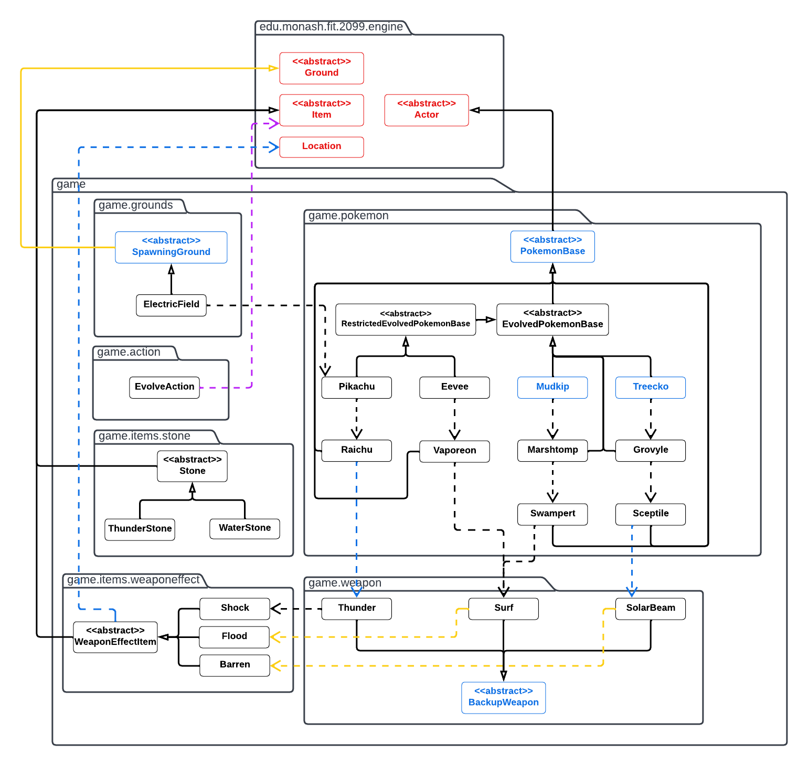
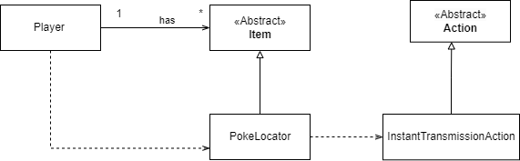
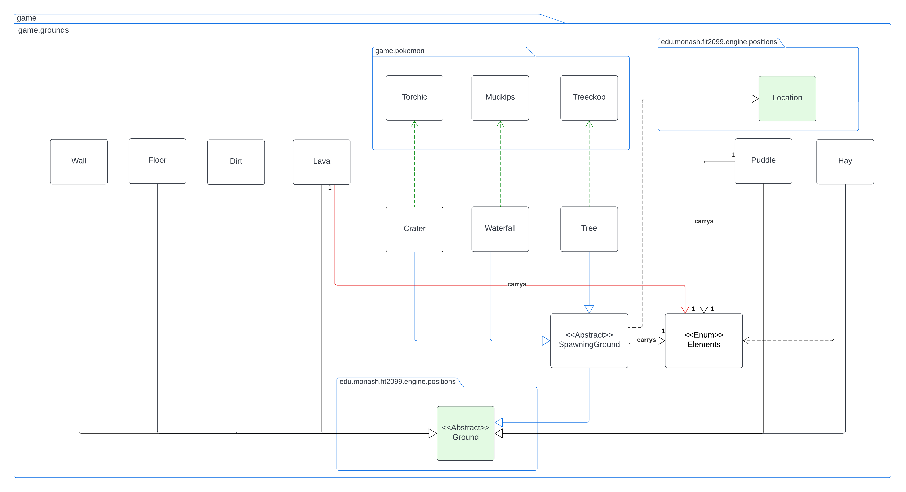
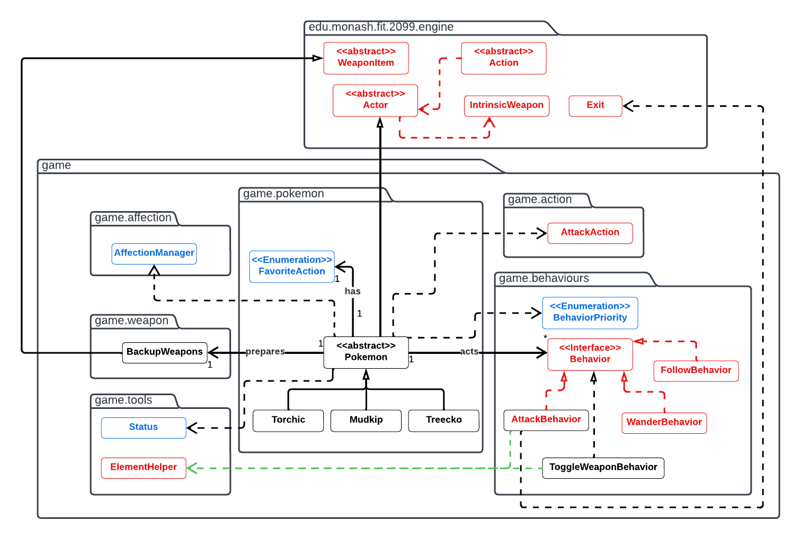
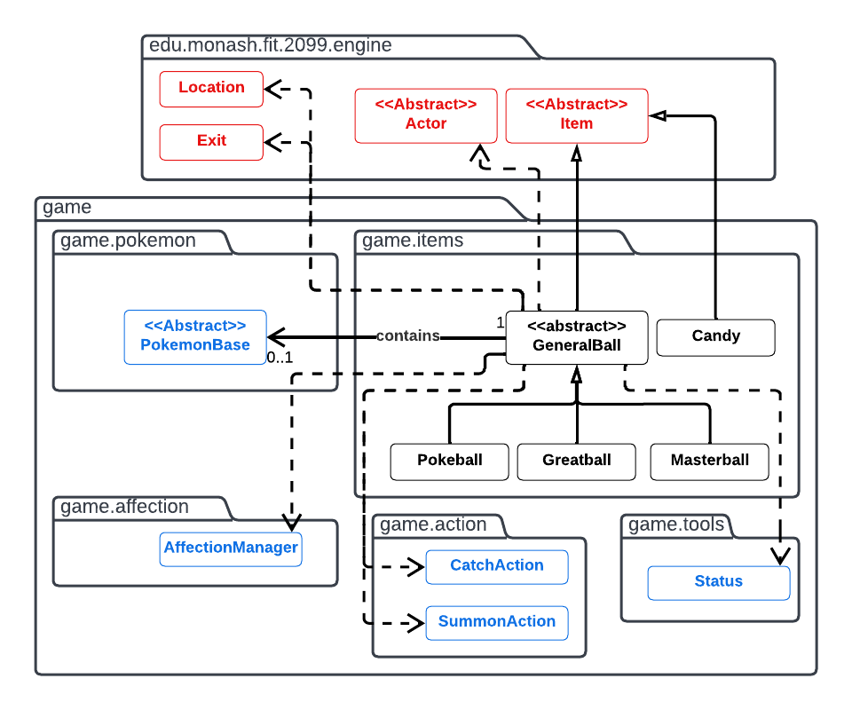
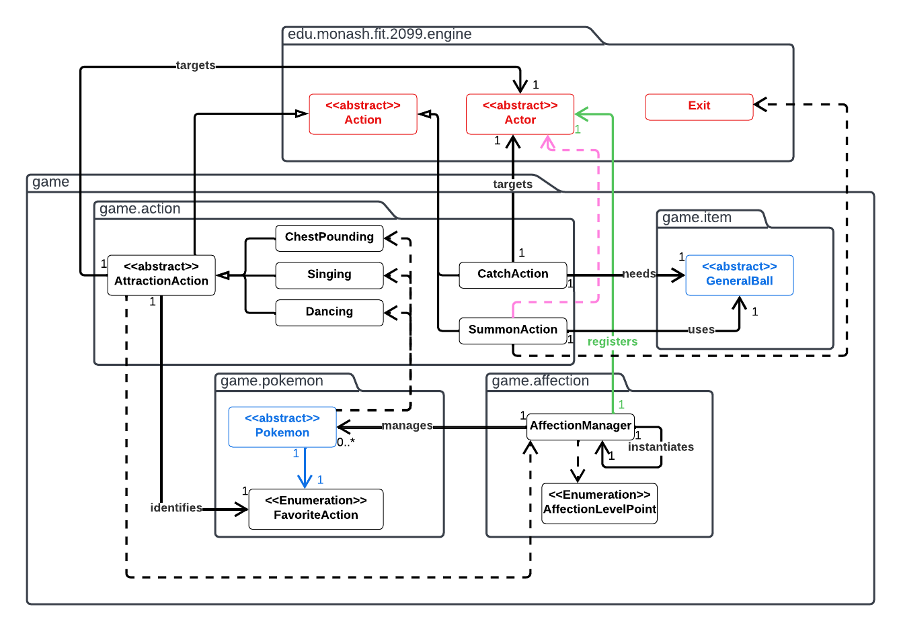
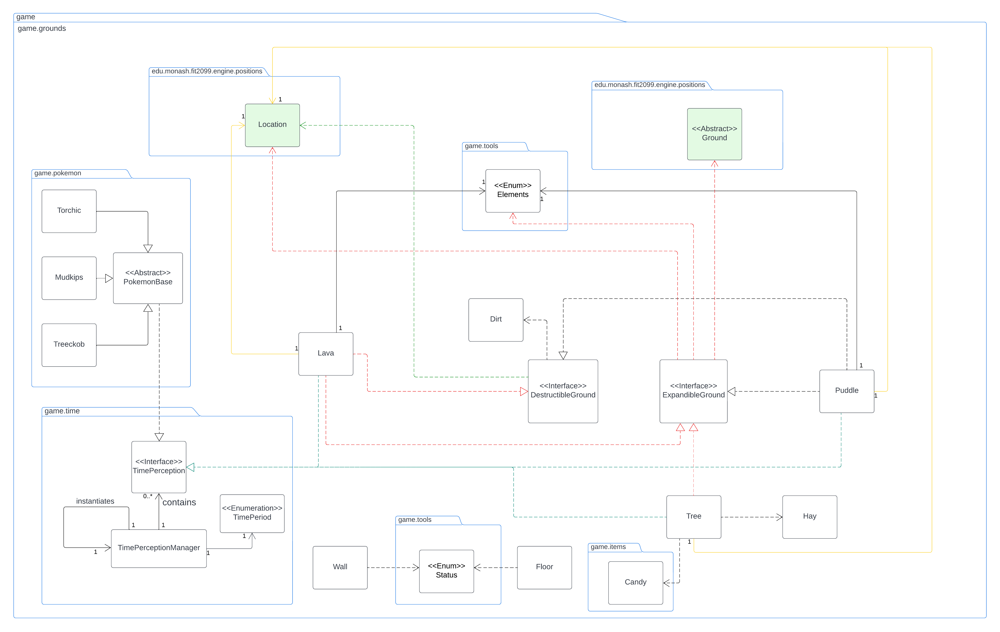
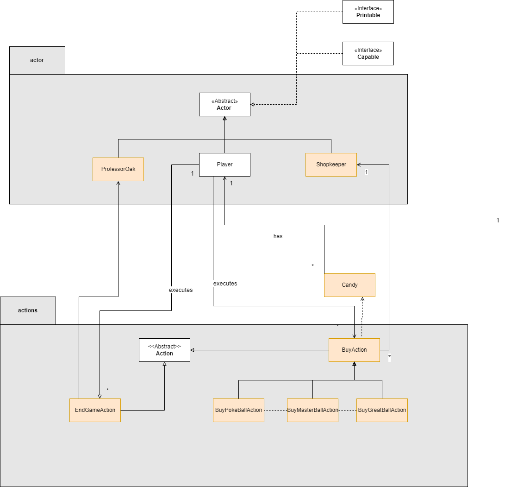

# FIT2099 Assignment (November 2022) - Pokemon!

## FIT2099_Lab01Team17
Team members:

25348914 Zecan Liu zliu0207@student.monash.edu

31893902 Jordan Nathanael jnat0012@student.monash.edu

33243271 Aashlesha Gaur agau0008@student.monash.edu

Link to contribution logs spreadsheet: [https://docs.google.com/spreadsheets/d/1QeySXoTWwXk9gglpJQzY4sfR8xn8tGG2epjmaYE85BM/edit?usp=sharing]

Design Docs for A1 is under docs.DesignDocs.A1 Design Docs Directory which contains REQ 1&3&5 UMLs and design rationale (Author: Zecan Liu).

We were in different groups during A1. 

## Design Rationale - Assignment 3

### REQ 1

This diagram represents an Evolution feature especially for Torchic's evolution line.

There is a new abstract class named EvolvedPokemonBase that need to be applied by every pokemon that can evolve into another pokemon. This aligns with Open-Closed Principle and also avoids the repetition in the code.

As we can see from Blaziken, it has dependency toward the FireSpin because we create that weapon. FireSpin also has dependency toward Fire inside game.items.weaponeffect package because FireSpin will create a Fire nearby the Blaziken which this is the reason we have dependency between WeaponEffectItem and Location. 

I created an abstract class named WeaponEffectItem that is inherited by Fire because this weaponEffect can't replace the ground and we can easily remove and add inside the gameMap, which logically easy to be done if we inherits this WeaponEffectItem toward Item abstract class. This also aligns with Open-Closed Principle because abstract class WeaponEffectItem can be easily extended like what we did in REQ3 (Creative Mode)

Torchic has dependency toward Combusken as well as Combusken has dependency toward Blaziken because everytime they evolve, they will create a return a new Pokemon.

There is also a new Behavior named EvolveBehavior because this concrete class is a result of Open-Closed Principle that has been applied in the Behavior so we can easily extend the behavior. This behavior also aligns with Single-Responsibility Principle. Because if we do the evolution mechanism inside the Pokemon, it will violate the SRP.

Besides that, there is also a new Action named EvolveAction that inherits from Action abstract class which aligns the Open-Closed Principle and SRP.

### REQ 2

### REQ 3 (Creative Mode)
**Title**:
_Evolution with a particular Item and Extra Pokemon Evolution with their own weapon effect._

**Description**:
* Add Mudkip evolution which are:
  * Marshtomp
      * have new backupWeapon which is Water Gun
  * Swampert
    * have new backupWeapon which is Surf
      * Surf will affect 24 tiles (forming a square) near its location and those area becomes ‘flood’s
      * It has duration of 3 and every actor that within the area effect will get hurt by 3 each turn
      * Besides getting hurt, the actor also can’t move for that duration.

* Add Treecko evolution which are:
    * Grovyle
        * have new backupWeapon which is Leaf Storm
    * Sceptile
        * have new backupWeapon which is SolarBeam
          * Solarbeam will affect 24 tiles near actor location and those area becomes ‘barren’s
          * has duration of 5 turn
          * every actor which stand of the effect will be hurt by 2 if they don’t have any similar element
          * If they are having a same element, they will be healed by 2
* Add new pokemon, Pikachu and its evolution which is Raichu
    * Pikachu
        * have new backupWeapon which is Body Slam
        * Need ThunderStone to evolve (Evolution can be done with Player help only)
    * Raichu
        * have new backupWeapon which is Thunder
          * Thunder will affect the 0-8 tiles near the actor locations
          * has duration of 2 turns
          * Every actor that is shocked will be paralyzed for 2 turns and hurted 15 for each turn.
* Add new pokemon, Eevee and its one of the evolution which is Vaporeon
    * Eevee
        * Have new backupWeapon which is Swift
        * Need WaterStone to evolve into Vaporeon (Mechasnism is same with Pikachu)
    * Vaporeon
        * have a new backupWeapon which is Surf (Same like Swampert's backupWeapon)
* Add new abstract class named Stone
    * ThunderStone , is used to help Pikachu to evolve into Raichu
    * WaterStone, is used to help Eevee to evolve into Vaporeon
* Add new ground that have electric element for Pikachu and Raichu environment named ElectricField.
    * ElectricField is a SpawningGround, that will spawn Pikachu_

**Explanation why it adheres to SOLID principles** (WHY):

- Abstract class Stone aligns with Open-Closed Principle so that we can add more EvolutionItem.
- Abstract class WeaponEffectItem also aligns with Open-Closed Principle.
- Abstract class RestrictedEvolvedPokemonBased aligns with DRY principle so that we don't have to repeat the similarity among concrete classes that inherits this abstract class.

| Requirements                                                                                                            | Features (HOW) / Your Approach / Answer                                                                                                                                                                                                                          |
| ----------------------------------------------------------------------------------------------------------------------- |------------------------------------------------------------------------------------------------------------------------------------------------------------------------------------------------------------------------------------------------------------------|
| Must use at least two (2) classes from the engine package                                                               | _Actor, is inherited from PokemonBase. Location, to modify the location that is affected by the weaponEffect. Item, is inherited by Stone abstract class. Ground, is inherited from SpawningGround_                                                              |
| Must use/re-use at least one(1) existing feature (either from assignment 2 and/or fixed requirements from assignment 3) | _We use evolution feature from REQ1 Assignment 3_                                                                                                                                                                                                                |
| Must use existing or create new abstractions (e.g., abstract or interface, apart from the engine code)                  | _We use existing abstraction from REQ1 (EvolvedPokemonBase) and also create a new one named RestrictedEvolvedPokemonBase_                                                                                                                                        |
| Must use existing or create new capabilities                                                                            | _We used some existing capabilities of Element such as Element.WATER, GRASS; However, we created a new capabilities of Element and Status such as Status.EVOLUTION_RESTRICTED, Status.MOVEMENT_RESTRICTED, Element.GROUND, Element.NORMAL, and Element.ELECTRIC_ |

---

#### UML DIAGRAM

The diagram represents an object-oriented system for a feature where evolution can be done if the player has a specific item to help the pokemon to evolve.

The new pokemons that have a restriction for the evolution process are Pikachu and Eevee. I created RestrictedEvolvedPokemonBase abstract class that inherits from EvolvedPokemonBase because to avoid repetitions (DRY) and to align with Single-Responsibility Principle where RestrictedEvolvedPokemonBase has a similarity where that need an attribute to save the name of the item for the evolution.

Certain Pokemon will have their unique BackupWeapon with their own unique weapon effect. Due to similarity for each WeaponEffect, there is abstract class WeaponEffectItem that will be inherited by Shock, Flood, and Barren. Those three WeaponEffect concrete class has dependency with Thunder, Surf, and SolarBeam respectively because those weapon will create those WeaponEffect on GameMap. This design also aligns with Open-Closed principle because it will be easy to be extended.

Related BackupWeapon's feedback from Assignment 2, there is another alternative that can be done instead of applying the current design where each PokemonBase will have an association with BackupWeapon as an ArrayList, we can still have an association with BackupWeapon but not as ArrayList, so that the BackupWeapon will store all the weapon for the pokemon. However, with the latter option, we will have issue with access modifier, so that's why I still keep the first approach to be implemented in this Assignment 3.

There is also a new abstract class named Stone that inherits Item that will be used to help RestrictedEvolvedPokemonBase to evolve. This aligns with the Open-Closed principle because we can add more stone based on the situation for the game. Everytime Player helps the evolution, EvolveAction will remove that related stone from the Player inventory, that's why we have dependency between EvolveAction and Item.

There is also a new concrete class that inherits from SpawningGround that will spawn Pikachu named ElectricField. This can be easily created because the original design has already meet the Open-Closed principle.

# Requirement 4  (Creative Mode)

**Title**:
Pokelocator aids Ash, the Player to teleport to a certain Pokemon and continue the game.

**Description**:
- The Pokelocator is added to the inventory, and has actions which allow it to instantly transport to either Mudkip, Treecko or Torchic
- InstantTransmissionAction, check where the current location of Ash is and which Pokemon Ash wants to go to, if that particular pokemon is present on the map (determined if their char is present or not). If the specified pokemon is there it will move Ash to the closest adjacent position. 
- However, if the pokemon is not present a message will be displayed stating '(specified pokemon ) is not on the map yet!'.
- If the pokemon exists but there is no location vacant (i.e, pokemon is surrounded by other actors or pokemon) then Ash will not be able to go next to it.

**Explanation why it adheres to SOLID principles** (WHY):
- InstantTransmissionAction class extends Action and adheres to the Single Responsibilty Principle (SRP) as it's only purpose is move the Player to the pokemon.
- InstantTransmissionAction class aligns with DRY principle because we did not create new classes on that action for each Pokemon.
- Open close principle was not violated because we did not have to modify the parent class Action and Item while adding InstantTransmissionAction and PokeLocator respectively.

| Requirements                                                                                                            | Features (HOW) / Your Approach / Answer                                                                                       |
| ----------------------------------------------------------------------------------------------------------------------- |-------------------------------------------------------------------------------------------------------------------------------|
| Must use at least two (2) classes from the engine package                                                               | _Use two classes from engine package  InstantTransmissionAction class extends Action and PokeLocator class extends Item._ |
| Must use/re-use at least one(1) existing feature (either from assignment 2 and/or fixed requirements from assignment 3) |                                                                                                                               |
| Must use existing or create new abstractions (e.g., abstract or interface, apart from the engine code)                  |                                                                                                                               |
| Must use existing or create new capabilities                                                                            | Using add action method and addItemtoInventory method                                                                         |

---

## Design Rationale - Assignment 2 

### REQ 1

Based on A1 feedback, I have deleted the unnecessary relationships between abstract **SpawningGround** class and **Exit** class. Now **SpawningGround** class has a dependency relationship with **Location** class as **Waterfall** and **Tree** need to check surrounding locations in order to spawn Pokemons. 

Also I have corrected the relationship between **Crater** & **Waterfall** & **Tree** and Pokemon classes. Instead of having association relationship with **PokemonBase**, the actual spawning ground class is now having the dependency relationship with actual spawned Pokemon class. 

### REQ 2

The diagram represents an object-oriented system for part of the pokemon game that focuses only for Pokemon criteria only. This diagram has three concrete classes that represent pokemon that exist inside the game.

All three types of pokemons extended the abstract Pokemon class. To avoid repetitions (DRY) and since they share some common attributes (Element and PlayerInteraction) and methods, it is logical that it is an abstract class.

Each pokemon acts in the same way of numeral types of behaviors and to implement Open-Closed Principle, Pokemon abstract class has an association towards Behavior interface.

One of the behaviors that inherits this interface is AttackBehavior class. Each pokemon is designed to have two ways of attacking other pokemon which are using intrinsicWeapon or WeaponItem. Because everytime the game runs, the pokemon need to check its own stepped ground, so we introduced new behavior called ToggleWeaponBehavior just to check every turn whether the pokemon will use intrinsicWeapon or backupWeapon. This approach aligns with Single Responsibility Principle.

SpecialWeapon inherits from WeaponItem abstract class which also inherits from Item abstract class. This way of design ensures the robustness of polymorphism which aligns with the Liskov Substitution Principle.

### REQ 3

Based on A1 feedback I have corrected the multiplicity between **PokemonBase** and **Generalball** class.

This design is more comprehensive than A1 design. 

Each GeneralBall will have dependency with CatchAction and SummonAction because we will use GeneralBall whenever there are pokemons near the Player to catch it. However, because of the limitation of code of the engine, this CatchAction can't be used in the first turn. 

Another alternative to do this is by using design pattern so later the catchAction will not be hindered like this.

### REQ 4

The diagram represents an object-oriented system for interactions within the game. This diagram focuses on game.action and game.affection package.

Inside game.action package, there are 5 concrete class that inherit from Action abstract class because those five classes have the same functionality as already given inside the Action class. Those five classes will have their own role which aligns with the Single Responsibility Principle.

Specifically for ChestPounding, Singing, and Dancing concrete class, they inherit from AttractionAction first because those three have the same functionality which are related with action that the another Actor can interact with the PokemonBase. This way of design ensures that we can add more attractionActions without modifying the class itself which is related to Open-Closed Principle.

CatchAction and SummonAction has an association with GeneralBall abstract class because both of them have a really close relation with the GeneralBall which the ball will be used to stored the captured pokemon inside it and summon the captured pokemon from it. Even though both actions are related with pokemon indirectly, SummonAction doesn't need an association with Actor like CatchAction because SummonAction can retrieve the pokemon from the GeneralBall while CatchAction will not get any pokemon when we try to retrieve it.

AffectionManager applies a singleton design pattern because it will make things easier for other class who want to get the AffectionPoint from the pokemon by its ability to be called anywhere.

AffectionManager have a dependency towards AffectionLevelPoint because it will manage the pokemon whether it is categorised into which Affection Level Point.

### REQ 5

Compared to A1, this design is more comprehensive for ground classes in order to implement the logics of time. 

There are three different grounds and Pokemons will experience the pass of time. The logics for pokemons are relatively simple. 

**PokemonBase** class implement **TimePerception** interface and in each Pokemon's constructor, it will run the registerInstance method which added the object into timePerceptionList.

As for ground, I have created two new interfaces which contain default methods to implement the 'expand' and 'destroy' of grounds. This design follows the **Interface Segregation Principle** as **Tree** class does not need to destroy, therefore, a single Interface does not satisfy this requirement.

Moreover, the default methods inside these interfaces follows the DRY principle as the 'destroy' and 'expand' logics for different grounds are quite similar.

Similarly, these grounds classes also implement the **TimePerception** interface and run the registerInstance method in constructors.

Floor and Wall classes can't be coverted to another ground, therefore, I created an Enum status 'NONCONVERTIBLE' which used to distinguish these two grounds. 

### REQ 6

- Compared to A1, I have made a few modifications to make the implementation less complex.
- Before, I had decided to include a 'ShopHelper' that would interact with the player's inventory. However, while implementing this code I realised this was not actually necessary because the ShopKeeper has an unlimited inventory which means I would not need the ShopHelper class to manage different inventories.
- ShopKeeper and ProfessorOak are both now singleton classes because it is practical for them to only have one instance of themselves because there can only be one ShopKeeper and ProfessorOak.
- The BuyAction class has been modified to be an abstract class because there can be multiple buy actions and the BuyAction class itself is not specfic. The BuyAction class does not need any objects created from it which is why it is made to be abstract.